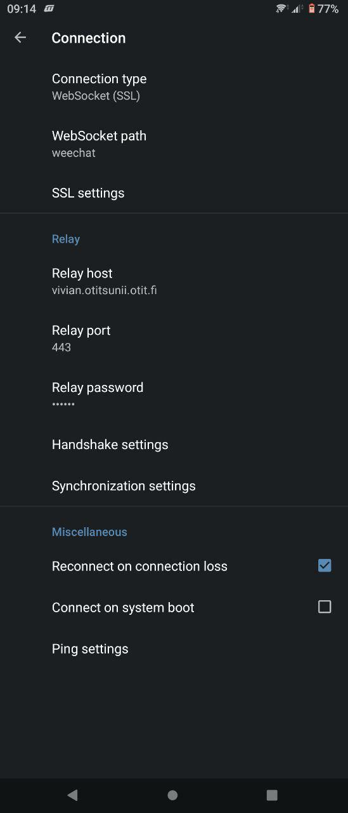

### Vaihtoehtoinen IRC-OPAS

Jos IRC ei ole ennestään tuttu, niin kannattaa katsoa [perinteinen IRC-OPAS](https://otit.fi/tietopankki/irc-opas/) ennen tätä.

Perinteisen [screen + irssi](https://otit.fi/tietopankki/irc-opas/) tyylin lisäksi irkkaaminen on nyt mahdollista myös Weechatin ja sen relay pluginin avulla.

Ideana siis on, että Weechat käynnistetään palvelimelle screeniin (kuten irssi), mutta siihen voi sen jälkeen yhdistää weechatin relay protokollan avulla esimerkiksi [Weechat-Androidista](https://play.google.com/store/apps/details?id=com.ubergeek42.WeechatAndroid.dev&hl=en_US&gl=US) tai [glowing-bearista](https://otitsunii.oulu.fi/glowing-bear/). Tämä on ainakin allekirjoittaneen mielestä huomattavasti miellyttävämpi tapa käyttää irkkiä esimerkiksi mobiililaitteilla, kuin SSH-yhteys ja komentoriviclientti.


#### 1. Kirjaudu otitsuniille

- Avaa SSH-yhteys otitsuniille omalla otitsunii tunnuksellasi
- Selvitä oma userid (tätä tarvitaan myöhemmin)
    ```
    echo $UID
    ```

#### 2. Avaa Weechat screeniin otitsuniilla

```
screen -S weechat weechat
```

#### 3. Konfiguroi Weechat

- Lisää irc palvelin esim. seuraavasti:
    ```
    /server add ircnet irc.oulu.fi/6667 -autoconnect
    ```
    - Weechattiin löytyy quickstart opas osoitteesta [https://weechat.org/files/doc/stable/weechat_quickstart.en.html](https://weechat.org/files/doc/stable/weechat_quickstart.en.html) ja edistyneempi opas [https://weechat.org/files/doc/stable/weechat_user.en.html](https://weechat.org/files/doc/stable/weechat_user.en.html)
- Lisää relay
    ```
    /set relay.network.password <joku vahva salasana tähän>
    /set relay.network.bind_address "::1"
    /relay add ipv6.ssl.weechat <portti>
    ```
    - **\<portti\> kohdalle tulee lukuarvo joka on 2*userid + 10000 (tämän takia userid selvitettiin aiemmin)**


#### 4. Yhdistä relayhyn

- ##### Weechat androidissa oikeasta yläkulmasta valikko --> settings --> connection ja kuvan mukaiset asetukset (tässä tapauksessa käyttäjänimi on vivian)
    
- ##### glowing bearissa kuvan mukaisesti
    